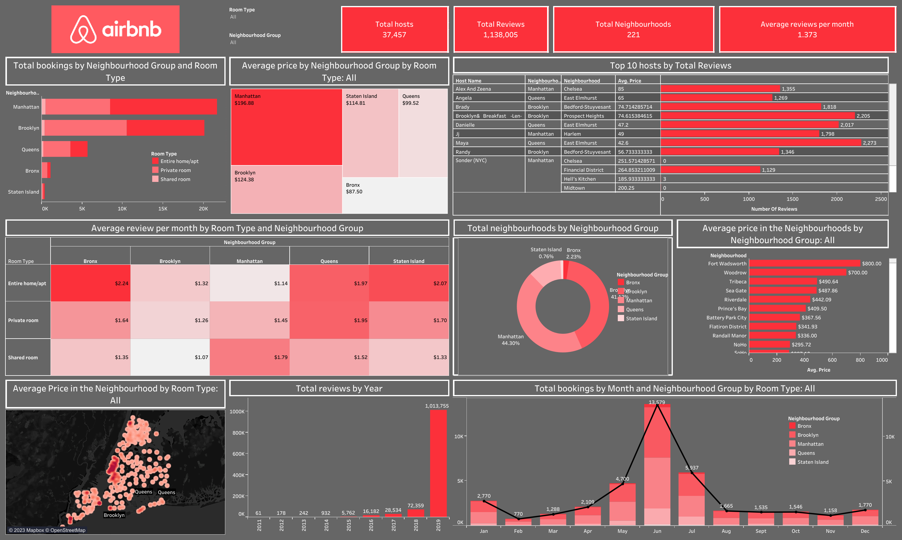

# Airbnb Sales Dashboard

 It is an American San Francisco-based company operating an online marketplace for short and long-term homestays and experiences. The company acts as a broker and charges a commission from each booking. 

You can find the interactice Dashboard from [here](https://public.tableau.com/views/AirbnbCase-study_16901803499090/airbnbDashboard?:language=en-GB&:display_count=n&:origin=viz_share_link).

This Dashboard was designed for analyzing Airbnb Sales Data provided in an [Excel Sheet](./AB_NYC_2019.xlsx).